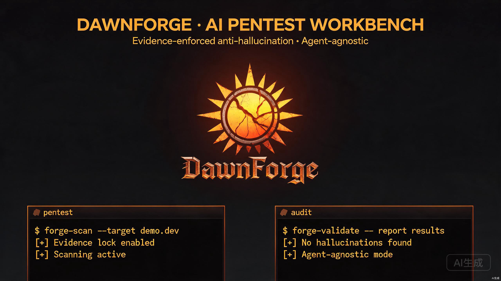

<div align="center">

# DawnForge · 破晓

**Multi-agent AI Penetration Testing Workbench**
**多 Agent 通用的 AI 渗透作战工作台**

> Forge your dawn on the battlefield. — 在战场上锻造你的黎明

[](https://github.com/xiabai2008/dawnforge-pentest/releases)
[](LICENSE)
[](https://github.com/xiabai2008/dawnforge-pentest/actions)
[](https://github.com/xiabai2008/dawnforge-pentest)
[](https://github.com/xiabai2008/dawnforge-pentest)
[](https://github.com/xiabai2008/dawnforge-pentest)

**Evidence-enforced anti-hallucination · Agent-agnostic · Continuously growing memory**
**证据强制反幻觉 · 多 Agent 通用 · 经验持续成长**



</div>

---

## What is it? / 它是做什么的？

`DawnForge` is not a "pile of tools" — it is a **growable AI-powered penetration testing environment**. It links tools, skills, experience, and security boundaries into a closed loop, letting an AI agent continuously understand targets, invoke tools, analyze results, and accumulate experience across long sessions.

`DawnForge` 不是一个"工具堆"，而是一套**让 AI 稳定参与渗透测试的可成长作战环境**。它把工具、技能、经验、安全边界连成闭环，让 Agent 在长会话中持续理解目标、调用工具、分析结果、沉淀经验。

Three things set it apart / 与普通工具箱最大的不同是三点：

1. **Evidence-enforced anti-hallucination / 证据强制反幻觉** — Every conclusion carries an `EVID` number and is verified character-by-character before being marked `VERIFIED`, structurally preventing AI from fabricating flags / credentials / vulnerability alerts.
2. **Agent-agnostic / 多 Agent 通用** — One persona + skill library serves **Claude Code / Codex / OpenCode / Cline / Trae**.
3. **Continuously growing memory / 经验持续成长** — Record every battle; the more you use it, the more it understands your playbook (memory layer + attack chains + cost stats).

---

## Quick Start / 快速开始

```bash
git clone https://github.com/xiabai2008/dawnforge-pentest.git
cd dawnforge-pentest
# First-time setup (download tools/dicts, install deps, create shortcuts)
# 首次部署（下载工具/字典、装依赖、建快捷命令）
./scripts/setup-new-pc.ps1
# Health check / 健康检查
python scripts/health-check.py
```

Then open the project directory in your preferred agent (Claude Code / Codex / OpenCode…) and describe your target directly:

然后在你常用的 Agent（Claude Code / Codex / OpenCode…）中打开项目目录，直接描述目标：

```text
扫一下 192.168.1.10                    Scan this IP
测一下 http://example.com              Test this website
帮我审计这个 JS                         Audit this JS
这个 JWT 看看有没有越权                Check this JWT for privilege escalation
用 AI 分析一下扫描结果                 Analyze scan results with AI
```

The agent reads `AGENTS.md` and automatically enters the pentest-expert persona, choosing tools and skills by the rules.

Agent 会读取 `AGENTS.md` 自动进入渗透专家角色，按规则选工具和技能。

### Connect your agent / 接入你的 Agent

```bash
# Link/copy skills to your agent's convention directory
python scripts/setup-agent-links.py --apply          # all / 全部
python scripts/setup-agent-links.py --agents claude  # Claude Code only / 仅 Claude Code
python scripts/setup-agent-links.py --mode copy      # copy instead of symlink / 用复制代替软链
```

Per-agent config templates live in `templates/agent-configs/` (opencode/codex/claude examples).

各家 Agent 的配置模板见 `templates/agent-configs/`（opencode/codex/claude 示例）。

---

## Core Capabilities / 核心能力

### Toolchain (60+) / 工具链

Port scanning, web assessment, directory brute-force, crawling, subdomain, SQL injection, XSS, SSTI, deserialization, lateral movement, privilege escalation… Tool binaries live in `tools/`, unified entry points in `bin/`.

端口扫描、Web 评估、目录爆破、爬虫、子域名、SQL 注入、XSS、SSTI、反序列化、内网横向、提权……工具本体放 `tools/`，`bin/` 提供统一快捷入口。

| 场景 Scenario | 首选 Preferred | 备选 Alt |
|:-----|:-----|:-----|
| 快速端口扫描 Fast port scan | naabu | fscan（含服务识别）|
| 内网全扫描 Internal full scan | fscan | — |
| Web 漏洞检测 Web vuln detection | nuclei | xray（被动更安静）|
| 目录爆破 Directory fuzz | ffuf | gobuster |
| SRC 挖洞 SRC hunting | poxiao | rayscan |
| 深度 SQLi/XSS | rayscan | — |
| SQL 注入 | sqlmap | — |
| XSS 专项 | dalfox | nuclei |
| 提权辅助 Priv-esc assist | PEASS-ng | — |

### Skill Library (60+) / 技能库

`skills/pentest_skills/<name>/SKILL.md`, standard YAML frontmatter, compatible with the Anthropic Agent Skills format. Covers SQLi, XSS, SSRF, IDOR, JWT, deserialization, WAF bypass, subdomain takeover, and all mainstream vulnerability classes.

`skills/pentest_skills/<name>/SKILL.md`，带标准 YAML frontmatter，兼容 Anthropic Agent Skills 格式，覆盖 SQLi、XSS、SSRF、IDOR、JWT、反序列化、WAF 绕过、子域名接管等全部主流漏洞方向。

### Evidence Loop (anti-hallucination core) / 证据闭环（反幻觉铁律）

```
harvest → archive → report
tool output → extract claims → assign EVID + verify char-by-char → archive to memory → generate auditable report
工具输出 → 提取结论 → 分配EVID+逐字符校验 → 沉淀记忆 → 生成可复核报告
```

```bash
python -m scripts.evidence_pack.cli harvest \
  --tag T01 --target $TARGET --claim "SQL 注入存在于 /api/login"
python -m scripts.evidence_pack.cli archive evidence/manifest_T01.json
python -m scripts.evidence_pack.cli report evidence/manifest_T01.json --format md
```

### Experience System / 经验系统

Each task writes `memory/pentest-experience-NNN.md`; reusable attack chains go to `memory/attack-chains.yaml`; cost data to `memory/cost-stats.csv`. Experience feeds back into the next decision.

每次任务结束写入 `memory/pentest-experience-NNN.md`，可复用攻击链记入 `memory/attack-chains.yaml`，成本数据记入 `memory/cost-stats.csv`。经验会反过来影响下一次判断。

> **Your experience is private / 经验是个人私有的** — Personal experience files are `.gitignore`d and never committed. Every user starts from the shared `memory/templates/` skeleton and builds their own experience library.
> 个人经验文件已被 `.gitignore` 忽略，永不提交。每位使用者从仓库的 `memory/templates/` 骨架出发，建立属于自己的经验库。

### Training Ranges (local, Docker) / 本地靶场

`targets/` provides a one-command local training environment (DVWA / Juice Shop / WebGoat / VAmPI) covering PHP / Node.js / Java / Python, with an 8-week learning path.

`targets/` 提供一键启动的本地训练环境（DVWA / Juice Shop / WebGoat / VAmPI），覆盖 PHP / Node.js / Java / Python 四大技术栈，并附 8 周训练路线。

### Security Boundaries / 安全边界

- Default `permissions.mode = "ask"`, high-risk operations require human confirmation — 默认 `permissions.mode = "ask"`，高危操作人工确认
- `config/scope.yaml` authorization whitelist check — 授权白名单校验
- Three combat modes: `safe / normal / aggressive` — 三档作战模式
- `.gov` / `.mil` blocked; `169.254.169.254` cloud metadata blocked — 禁止 `.gov` / `.mil`；禁止访问云元数据地址
- Found a vulnerability in DawnForge itself? Report privately via [SECURITY.md](SECURITY.md) — 发现 DawnForge 自身漏洞？请走 [SECURITY.md](SECURITY.md) 私有上报

---

## Project Structure / 项目结构

```text
dawnforge-pentest/
├── AGENTS.md        核心作战说明（多 Agent 自动读取）
├── CLAUDE.md        Claude Code 桥接说明
├── README.md
├── bin/             工具快捷命令
├── config/          字典、payload、作战配置、爆破脚本
├── docs/            设计文档、品牌方案
├── memory/          经验记忆库、攻击链、成本记录
├── scripts/         部署、编排、证据闭环、通用化脚本
├── skills/          Agent 技能体系（60+）
├── targets/         本地靶场一键编排
├── templates/       多 Agent 配置模板
└── tools/           工具本体（不入库，部署时下载）
```

## Directory Duties / 目录分工

```text
results/   raw scan output, JSON intermediates / 原始扫描结果、JSON 中间结果
reports/   final HTML / DOCX / PDF reports / 最终报告
evidence/  evidence packs, manifests, minimal samples / 证据包、manifest、最小化样本
```

These directories and sensitive files are written to `.gitignore` and are not committed by default.

以上目录和敏感文件已写入 `.gitignore`，默认不提交。

---

## Why You Might Like It / 为什么你可能喜欢它

- **Token-efficient / 省 token**: skills loaded on demand + append-only context, controllable long-session cost.
- **Trustworthy / 可信**: anti-hallucination evidence loop — conclusions are auditable and attributable.
- **Universally compatible / 通用**: one asset serves all mainstream agents, no rewriting per tool.
- **Growing / 成长**: experience accumulates; the more you use it, the better it works.

## Contributing / 贡献

Community guidelines: [CODE_OF_CONDUCT](CODE_OF_CONDUCT.md) · [CONTRIBUTING](CONTRIBUTING.md) · [CHANGELOG](CHANGELOG.md) · [AUTHORS](AUTHORS.md)

社区规范：[CODE_OF_CONDUCT](CODE_OF_CONDUCT.md) · [CONTRIBUTING](CONTRIBUTING.md) · [CHANGELOG](CHANGELOG.md) · [AUTHORS](AUTHORS.md)

See [CONTRIBUTING.md](CONTRIBUTING.md). Report bugs via [issues](https://github.com/xiabai2008/dawnforge-pentest/issues), and report security vulnerabilities privately via [SECURITY.md](SECURITY.md).

见 [CONTRIBUTING.md](CONTRIBUTING.md)。反馈 bug 请开 [issue](https://github.com/xiabai2008/dawnforge-pentest/issues)，安全漏洞走 [SECURITY.md](SECURITY.md) 私有上报。

## Responsible Use / 安全声明

**For authorized targets only.** Users must confirm the test scope and comply with local laws and regulations. Contributors must not submit real targets, credentials, or scan results.

本项目**仅用于授权目标**。使用者须确认测试范围，遵守当地法律法规。贡献者不得提交真实目标、凭据或扫描结果等敏感数据。

## License

[MIT](LICENSE). Third-party tools, dictionaries, and templates retain their respective copyrights and are provided for learning and research only.

[MIT](LICENSE)。第三方工具、字典与模板版权归各自原作者，仅供学习研究。

---

## Star History / 点亮 Star

If DawnForge helps you, a star is the best way to say thanks and helps others discover it.

如果 DawnForge 帮到了你，点个 Star 是最好的感谢，也能帮助更多人发现它。

[](https://star-history.com/#xiabai2008/dawnforge-pentest&Date)

### Support / 支持

- ⭐ Star the repo — 点亮 Star
- 🍴 Fork & PR — 分叉并提交 PR
- 🐛 Report issues — 提交 issue：[issues](https://github.com/xiabai2008/dawnforge-pentest/issues)
- 🔒 Report vulnerabilities privately — 安全漏洞私有上报：[SECURITY.md](SECURITY.md)
- 💬 Share with peers who do authorized pentesting — 分享给做授权渗透的同行